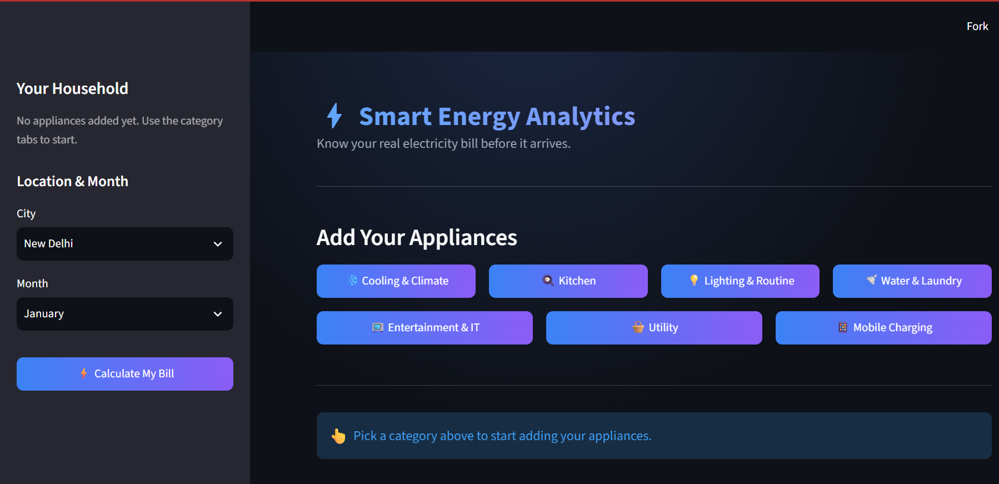
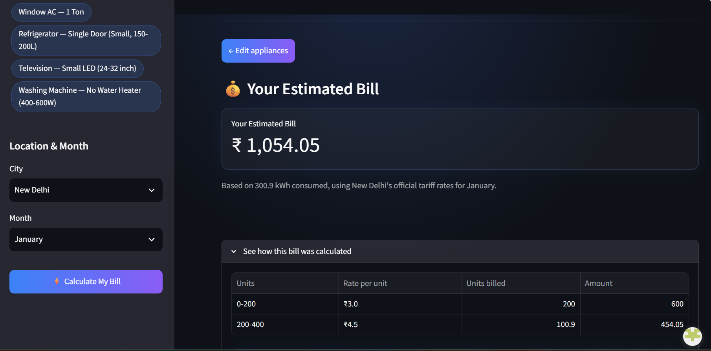
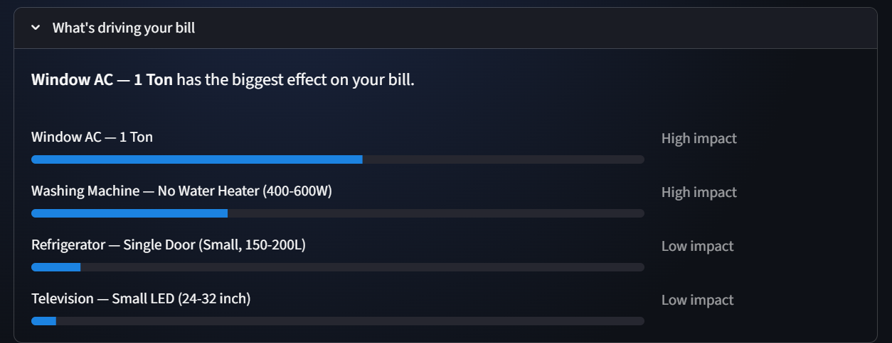

# ⚡ Smart Energy Analytics

**Know your real electricity bill before it arrives.**

Smart Energy Analytics is a Streamlit web app that estimates an Indian household's monthly electricity bill from actual appliance usage — appliance type, count, and daily hours — using real per-appliance wattage, duty-cycle correction, and each city's genuine slab-wise DISCOM tariff structure. It also breaks down exactly which appliances are driving the bill.

🔗 **Live app:** _add your Streamlit Cloud link here_

---

## Why this exists

Most "electricity bill predictor" projects train a regression model on a tabular dataset and call it a day. This project started the same way — a Random Forest Regressor trained on appliance counts, an aggregate usage-hours field, city, and tariff rate.

An EDA pass revealed the problem: the target column (`ElectricityBill`) was not a learned quantity at all. It was the exact arithmetic product of `Monthly Hours × Tariff Rate`, reproducible to within floating-point noise (~1×10⁻¹³). The model wasn't learning consumption behavior — it was memorizing multiplication.

So the project was rebuilt around a **transparent, physics-based calculation engine** instead of a black box:

```
Units (kWh) = Σ [ Count × Rated Wattage × Duty Cycle × Daily Hours × 30 ] ÷ 1000
```

- **40+ appliances** cataloged with real rated wattages across 7 categories (Cooling & Climate, Kitchen, Lighting & Routine, Water & Laundry, Entertainment & IT, Utility, Mobile Charging)
- **Duty-cycle correction** for compressor/thermostat-cycled appliances (ACs, refrigerators, geysers, room heaters, RO purifiers) so they don't overstate energy draw at full rated wattage
- **16 city/DISCOM tariff tables** (New Delhi, Mumbai, Pune, Chennai, Hyderabad, Kolkata, and more) applied as genuine multi-slab, telescopic rates — including subsidy slabs like Delhi's first-200-units concession
- A retrained ML model is kept only as a secondary, clearly-labelled cross-check — never as the source of truth for the bill shown to the user

## Features

- **Guided appliance input** — category → subtype → variant/size → count & hours drill-down, instead of a long flat form
- **City & month selection** with real slab tariffs applied per city
- **Instant bill estimate** with a full slab-by-slab cost breakdown
- **"What's driving your bill"** — ranks each appliance's contribution (High / Medium / Low impact) so users get an actionable priority list, not just a number
- Password-gated access for public deployment

## Screenshots

| Home | Appliance Selection |
|---|---|
|  |  |
| Household setup, city/month selection | Category → subtype drill-down |

| Bill Result | Contribution Breakdown |
|---|---|
|  |  |
| Estimated bill with slab-wise table | Appliance-wise impact ranking |

## Tech stack

| Layer | Tools |
|---|---|
| Frontend / App | Streamlit |
| Calculation engine | Python (pure functions, no Streamlit dependency) |
| Data handling | pandas, NumPy |
| ML cross-check | scikit-learn (RandomForestRegressor) |
| Visualization (EDA/notebooks) | matplotlib, seaborn |

## Project structure

```
Smart-Energy-Analytics/
├── app.py            # Streamlit UI — theming, login gate, navigation, input form, results page
├── core_logic.py      # Appliance wattage DB, duty-cycle table, tariff slabs, calculation functions
├── data/raw/          # Raw dataset(s) used for EDA / ML cross-check
├── notebooks/         # Exploratory data analysis
├── requirements.txt
└── README.md
```

`core_logic.py` is intentionally free of any Streamlit imports — it's independently testable pure logic. `app.py` handles all UI, session state, and navigation.

## Running locally

```bash
git clone https://github.com/Krish101205/Smart-Energy-Analytics.git
cd Smart-Energy-Analytics
pip install -r requirements.txt
streamlit run app.py
```

The app is password-gated. Create a `.streamlit/secrets.toml` file locally with:

```toml
password = "your-password-here"
```

## Known limitations

- Appliance usage inputs are manually entered / simulated — there's no public dataset of verified real household usage to validate against yet
- Single shared password, not full multi-user authentication
- Streamlit Community Cloud's free tier has an ephemeral filesystem, so there's no long-term data persistence across sessions
- No smart-meter / IoT integration yet — usage hours are self-reported

## Roadmap

- In-app feedback box for real users
- Persistent storage (Google Sheets / lightweight DB)
- Smart-meter / IoT integration for automatic usage tracking
- Benchmarking panel comparing a user's bill against city/dataset averages
- Multi-user authentication

## Background

This started as a 7th-semester B.Tech (EEE) minor project at GGSIPU, New Delhi. The full engineering writeup — including the original ML prototype, the EDA that exposed its flaw, and the rebuild — is documented in the project report (available on request / linked in repo).

## License

This project is licensed under the MIT License — see [LICENSE](LICENSE) for details.
